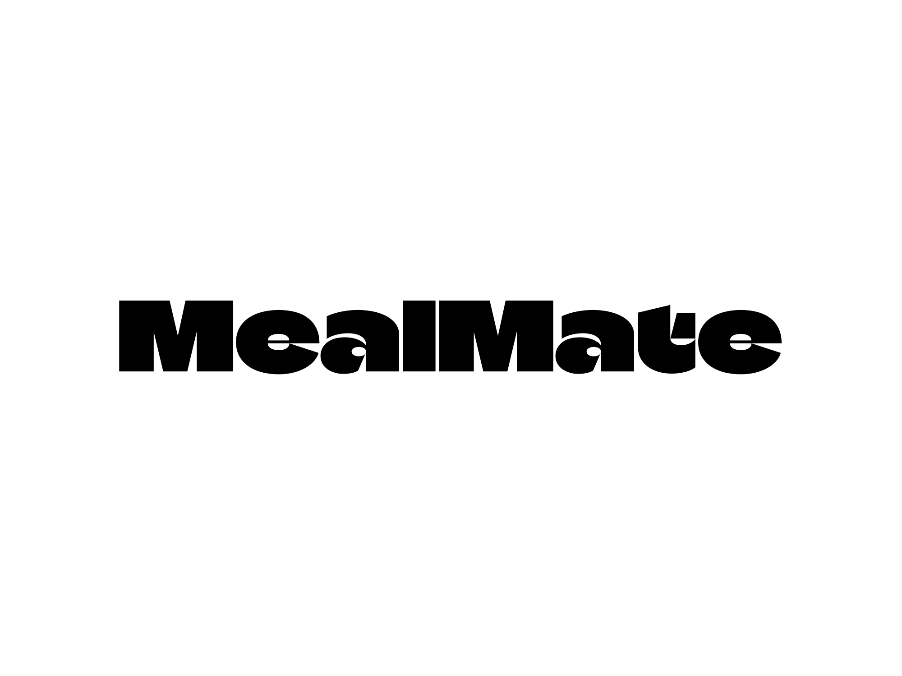

# MealMate
___

  

## AI-Powered Meal Planning Application
___
MealMate is a modern web application built with React and FastAPI that allows users to create, manage, and track their 
meal plans. The application features a responsive design and integrates with Google Gemini AI 
capabilities for generated meal plans based on user's needs.

## Project Structure

    mealmate/
    ├── frontend/
    │   ├── public/
    │   ├── src/
    │   │   ├── styles/
    │   │   └── components/
    │   |   
    │   ├── package.json
    │   └── tsconfig.json
    ├── backend/
    │   ├── api/
    │   └── test/
    └── database/
        └── fitnessDB.sql

## Features

🔐 **Advanced Security**
- OAuth 2.0 authentication & role-based access
- Secure password hashing & session management

📱 **Modern User Experience**
- Sleek, responsive design optimized for all devices
- Dark mode and light mode support

🤖 **AI-Powered Intelligence**
- Smart meal plan generation based on dietary preferences
- Real-time calorie estimation from food images
- Machine learning-based meal optimization
- Chatbot for personalized assistance

☁️ **Cloud Infrastructure**
- Frontend hosted on Azure for optimal global delivery
- Backend powered by AWS for maximum reliability
- Continuous deployment pipeline

## Showcase
The showcase of the application can be found [here](Showcase.md).
## Getting Started

### Prerequisites
- Node.js (v14 or higher)
- Python (v3.8 or higher)
- PostgreSQL/MySQL

### Installation & Running the Application

- For instruction on how to start the frontend webpage, please refer to the [frontend README](frontend/README.md).
- For instruction on how to start backend server, please refer to the [backend README](backend/README.md).

## Environment Variables

Create a `.env` file in the backend directory with:

    GOOGLE_API_KEY= <your gemini API key>
    DB_HOST= <your database host>
    DB_USER= <your database user>
    DB_PASSWORD= <your database password>
    DB_NAME= <your database name>
    DB_PORT= <your database port>

## Contributors
 - #### [David Nguyen](https://github.com/DavidNg32)
 - #### [Phoenix Bouma](https://github.com/boumster)
 - #### [Alyan Qureshi](https://github.com/AlyanQureshi)
 - #### [Jaival Patel](https://github.com/jaivalp22)
 - #### [Jerome Barcelona](https://github.com/jaybarc)
 - #### [Talaal Irtija](https://github.com/tirtija)

## License

This project is licensed under the MIT License - see the LICENSE file for details.

## Acknowledgments

This project was developed with the assistance of Generative AI tools:
- GitHub Copilot for code suggestions
- Google Gemini LLM API for meal suggestions and AI features